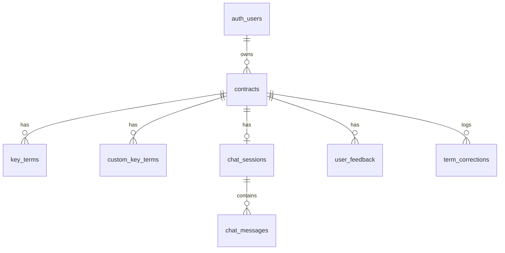

# ContractIQ — Engineering Design Document

**Status:** Draft for review (Stage 1 of Build Workflow)
**Source PRD:** `docs/ContractIQ_PRD.md` (v1.0, June 24 2026)
**Design tokens source:** `docs/design.md` ("allNeurons" design system)

> This document is the authoritative architecture reference. No implementation begins until it is approved. Stage 2 (`/implementation-specs`) reads this document to generate granular, runnable specs.

---

## 1. Executive Summary

**Project:** ContractIQ — an AI-assisted contract review tool that automatically extracts key terms from Non-Disclosure Agreements (NDAs) and Master Service Agreements (MSAs), attributes every extracted value to a page and source sentence, scores its own confidence, and lets users ask follow-up questions about the contract in plain English.

**Business goal:** Reduce the time a non-lawyer SMB founder, ops lead, or freelancer spends reviewing a routine NDA/MSA from an industry-average 90–120 minutes to ≤15 minutes, without requiring access to paid legal counsel.

**Problem statement:** SMBs and freelancers sign NDAs and MSAs regularly but lack in-house legal expertise. Generic AI chat tools produce unstructured summaries with no page attribution, no confidence signal, and no contract-type-specific term schema — so users still can't tell what to trust or where to look.

**Target users:**
- **Primary — Time-Pressed Founder / Ops Lead:** 5–15 NDAs/MSAs per month, no in-house legal counsel, currently relies on Google searches or ad-hoc $250–500/hr legal consultations.
- **Secondary — Freelancer / Consultant:** 1–4 MSAs per month from larger clients, signs without full review due to power imbalance, cannot afford legal review.

Both personas map to a single application role at MVP — there is no admin, reviewer, or team-member role. (Multi-user workspaces are explicitly a v1.2/post-MVP feature per the PRD roadmap.)

**Success criteria (from PRD §3):**

| Metric | Target |
|---|---|
| Time from upload to completed review | ≤ 15 minutes (baseline: 90 min manual) |
| Key-term extraction F1 | ≥ 88% (NDA), ≥ 85% (MSA) |
| Confidence calibration error | ≤ 0.10 per 10%-bucket |
| Time to first extracted key-term display | ≤ 30s P95 (≤20-page contracts) |
| Chat response latency | ≤ 15s P95 |
| Cost per contract analysis | ≤ $0.25 (target ≤ $0.20 extraction-only) |
| 30-day retention | ≥ 45% |
| AI correction rate | ≤ 12% of terms manually corrected |

---

## 2. Product Scope

### In scope (MVP — through v1.0 per PRD roadmap)

- Email/password authentication (Supabase Auth)
- PDF upload for NDA and MSA contracts only (≤10MB, ≤20 pages, ≤~15,000 tokens)
- Server-side text extraction at upload time, stored once, reused by both extraction and chat
- GPT-4o structured key-term extraction for standard NDA (10 terms) and MSA (12 terms) schemas
- Custom key-term addition (up to 5 per contract) before processing
- Confidence scoring (0–100%) with colour-coded, non-dismissible low-confidence warnings (<50%)
- Page-number attribution and expandable "Why?" source-sentence view per term
- Two-panel results view: PDF viewer (or text-viewer fallback) + key terms panel
- Click-to-navigate from key term → PDF page
- Inline correction of any extracted term, with original AI value preserved
- Contract chat (Q&A), grounded strictly in the uploaded document, full conversation history, mandatory page citation
- Persistent chat history per contract
- Dashboard with contract history (sortable), summary counts by type
- Thumbs up/down + comment feedback per contract review
- "Not legal advice" disclaimer on every results page
- 90-day data retention with auto-delete post last-access; manual delete-contract at any time
- RLS-enforced multi-tenant data isolation on every table

### Out of scope (MVP)

- Scanned/image PDFs (OCR) — graceful rejection only ("Scanned PDFs are not supported yet")
- Non-English contracts / non-US-UK governing law
- Contract types other than NDA and MSA
- Export to CSV/PDF (explicitly P2/Backlog — see Feature Breakdown)
- Batch upload
- Multi-user / team workspaces, roles, or permissions
- Contract comparison view
- Email notifications
- Chunked/vector RAG retrieval (full-context strategy only, contracts ≤15k tokens)
- Real-time multi-tab/multi-device chat sync (see §8, resolved ambiguity)

### Future enhancements (post-MVP, per PRD roadmap)

- **v1.1:** CSV/PDF export, batch upload (≤5 contracts), dashboard analytics charts
- **v1.2:** OCR for scanned PDFs, side-by-side contract comparison, email notifications, multi-user workspaces (team plans)

---

## 3. User Personas

| Persona | Role | Company size | Behaviour | Primary pain | App permissions |
|---|---|---|---|---|---|
| Time-Pressed Founder / Ops Lead | Founder, COO, Procurement Manager, Legal Ops Manager | 5–250 employees, no in-house legal | Signs 5–15 NDA/MSA/month | 90–120 min/contract, misses auto-renewal/indemnification/IP clauses | Full access to own contracts, chat, dashboard, feedback |
| Freelancer / Consultant | Individual contributor | N/A (solo) | Receives 1–4 MSAs/month from larger clients | Can't afford legal review, power imbalance discourages pushback | Full access to own contracts, chat, dashboard, feedback |

Both personas are represented by the same `auth.users` identity and have identical permissions — **there is exactly one application role at MVP.** All data access is scoped by `user_id` via Postgres RLS; there is no cross-user visibility, no admin console, and no elevated role.

---

## 4. User Flows

All flows follow: `User Action → Frontend Behavior → Backend Processing → Database Interaction → System Response`

### Flow 1 — New Visitor → Sign Up → Dashboard

| Step | User Action | Frontend Behavior | Backend Processing | Database Interaction | System Response |
|---|---|---|---|---|---|
| 1 | Lands on marketing page | Static landing page renders (`app/(marketing)/page.tsx`), no auth check | — | — | Value prop, demo, "Sign In" / "Get Started Free" CTAs shown |
| 2 | Clicks "Get Started Free" | Opens sign-up form (`app/(auth)/sign-up/page.tsx`) | `supabase.auth.signUp({ email, password })` called directly from client | Supabase Auth writes to `auth.users`; trigger (optional) seeds any per-user defaults | Email verification sent |
| 3 | Verifies email, session established | Auth callback route exchanges code (`app/auth/callback/route.ts`) | Supabase Auth issues session | — | Redirect to `/dashboard` |
| 4 | Lands on Dashboard, no contracts yet | `DashboardPage` (Server Component) queries `contracts` via RLS-scoped `supabase-js`, gets empty array | — | `select * from contracts where user_id = auth.uid()` → `[]` | Empty state: "No contracts reviewed yet — upload your first contract to begin" |

### Flow 2 — Returning User → Dashboard

| Step | User Action | Frontend Behavior | Backend Processing | Database Interaction | System Response |
|---|---|---|---|---|---|
| 1 | Signs in | `supabase.auth.signInWithPassword()` | Supabase Auth validates credentials | — | Error shown inline on invalid credentials; success redirects to `/dashboard` |
| 2 | Dashboard loads | `DashboardPage` fetches summary + recent contracts via TanStack Query (`['contracts']`) | — | `select` on `contracts` filtered/sorted by `user_id`, `created_at` | Summary card (total, by-type breakdown), last 5 contracts with status/date, "Review a Contract" CTA |

### Flow 3 — Core Flow: Contract Review

| Step | User Action | Frontend Behavior | Backend Processing | Database Interaction | System Response |
|---|---|---|---|---|---|
| 1 | Selects contract type, uploads PDF | `UploadWizard` (Zustand-tracked step), client-side pre-validation (size/type) | `upload-extract-text` Edge Function: parses PDF, extracts text with `[PAGE N]` markers, uploads bytes to Storage (non-blocking) | `insert into contracts (…, contract_text, page_count, status='processing')`; storage object at `{user_id}/{contract_id}/{filename}.pdf` | Pre-processing preview: standard term list for selected contract type shown immediately (client-side constant, no round trip needed) |
| 2 | Adds custom terms (optional, ≤5), clicks "Process Contract" | `TermPreviewList` + `CustomTermInput`; progress indicator (extract → analyze → compile) | `process-contract` Edge Function: builds few-shot prompt (standard + custom terms), calls GPT-4o (temp 0.1, JSON mode), normalizes confidence to 0–100, retries once on JSON parse failure, retries OpenAI call 3× with backoff on failure | `insert into key_terms (…)`, `insert into custom_key_terms (…)`, `update contracts set status='completed', processing_completed_at=now()` (or `status='error'` on failure) | Redirect to results page on success; inline error + "Try again" CTA on failure (contract remains `error`, no re-upload needed) |
| 3 | Views results | `ResultsPage` (Server Component, hydrates TanStack cache) renders `PdfViewer` (or `TextViewerFallback`) + `KeyTermsPanel` | `touch_contract_access` RPC fires on mount (updates `last_accessed_at` for retention) | `select` on `contracts`, `key_terms`, `custom_key_terms` | Two-panel layout; terms colour-coded by confidence (green ≥80, amber 50–79, red <50) |
| 4 | Clicks a page reference | `PageRefButton` sets `targetPage` in `panelUiStore` (Zustand) | — | — | Viewer scrolls to page, highlights nearest matching span (source-sentence substring search, page-border fallback) |
| 5 | Edits a term inline | `TermValueEditable` triggers optimistic update | `edit-key-term` Edge Function: validates ownership via RLS, writes new value, preserves `original_ai_value` on first edit, DB trigger logs to `term_corrections` | `update key_terms set value=…, is_edited=true`; trigger `insert into term_corrections` | "Edited" badge shown; save completes ≤2s; rollback on error |
| 6 | Opens chat | `ChatFAB` → `ChatSheet` | — | `select` on `chat_sessions`/`chat_messages` (session created lazily on first message if none exists) | Chat panel opens within same view |

### Flow 4 — Chat with Contract

| Step | User Action | Frontend Behavior | Backend Processing | Database Interaction | System Response |
|---|---|---|---|---|---|
| 1 | Types a question, sends | `ChatComposer` optimistically appends user message to `['chat-messages', sessionId]` | `chat-message` Edge Function: creates session if absent, fetches full `contract_text` + full message history (≤200, ascending), classifies query (`contract`/`history`/`both`) via keyword heuristic, calls GPT-4o (temp 0.4) with document-only system prompt | `insert into chat_messages (role='user', …)` | Message shown right-aligned immediately |
| 2 | Waits for response | Loading indicator in `ChatMessageList` | Model returns free text with mandatory `[Page X]` citation; response parsed for `cited_pages` | `insert into chat_messages (role='assistant', cited_pages=…, query_classification=…)` | Response shown left-aligned within 15s P95, "Based on the document…" framing, clickable page citation chip |
| 3 | Clicks citation | `PageCitationChip` sets `targetPage` | — | — | Viewer scrolls to cited page |

---

## 5. Frontend Architecture

**Stack:** Next.js 14 (App Router), TypeScript, Tailwind CSS, shadcn/ui (Radix primitives), TanStack Query, Zustand, PDF.js.

### Design tokens (source of truth: `docs/design.md`)

| Token | Value | Usage |
|---|---|---|
| Brand / interactive | Blue 500 `#115ACB` | CTAs, links, focus rings |
| Text primary | Grey 900 `#070A0E` | Body text, headings |
| Text secondary | Grey 500 `#4A4C4F` | Captions, metadata |
| Success | Green 500 `#13A10E` (bg tint Green 50) | Confidence ≥80%, saved states |
| Error | Red 500 `#D13438` (bg tint Red 50) | Confidence <50%, form errors |
| Warning | Yellow 500 `#FFAA33` (bg tint Yellow 50) | Confidence 50–79% |
| Surface | White `#FFFFFF` (cards/modals), Grey 25 `#FAFAFA` (page bg), Grey 50 `#F0F0F1` (dividers) | |
| Font | Inter Display, all weights | Sole typeface |
| Spacing | 4px grid; page padding 112px/96px; section gap 40px; sub-section gap 24px | |
| Radius | 4px (badges/tags), 6px (buttons/inputs), 8px (cards), 12px (modals) | |

shadcn/ui primitives are restyled against these tokens via Tailwind config (`tailwind.config.ts` maps CSS custom properties from `docs/design.md`'s Implementation Guidance section directly).

### State management split

| Layer | Tool | Owns |
|---|---|---|
| Server state | TanStack Query | `contracts`, `contract` detail, `key-terms`, `chat-messages`, `feedback`, `signed-url` |
| Client UI state | Zustand | Upload wizard step/contractType/customTerms, `targetPage`/`chatOpen`/`viewerZoom`, per-contract chat draft |

Query keys and invalidation are enumerated in §9 (API Specification) alongside each Edge Function, since each mutation's cache effects are part of that function's contract.

### UX states

- **Loading:** `Skeleton` components on dashboard rows, key-term cards, and PDF pages; multi-step `Progress` indicator during processing (extract → analyze → compile)
- **Empty:** Dashboard empty state on zero contracts; key-terms panel shows nothing to render until `process-contract` resolves
- **Error:** Inline `Alert` for upload validation failures (oversized file, wrong type, scanned-PDF rejection), `error` contract status with retry CTA (no re-upload required), toast (`Sonner`) for transient mutation failures (edit save, feedback submit)
- **Responsive:** Results page two-panel layout collapses to stacked/tabbed on mobile viewports (`ResizablePanelGroup` → `Tabs` below `md` breakpoint)
- **Accessibility:** WCAG 2.1 AA target — shadcn/ui (Radix) primitives provide keyboard nav and ARIA out of the box; confidence colour-coding is paired with icon + text label, never colour alone

### Page and component hierarchy

```
app/
  (marketing)/page.tsx                    Landing page
  (auth)/sign-in/page.tsx, sign-up/page.tsx
  auth/callback/route.ts                  Supabase auth code exchange
  (app)/                                  Auth-gated group (middleware-protected)
    dashboard/page.tsx                    Summary + sortable contract list
    upload/page.tsx                       UploadWizard (single route, step in Zustand)
    contracts/[contractId]/page.tsx       Results page (see below)
    settings/page.tsx
```

Results page component tree (`app/(app)/contracts/[contractId]/page.tsx`):

```
ResultsPage (Server Component — SSR fetch + hydrate)
 └─ ContractWorkspace (Client)
     ├─ DisclaimerBanner              [Alert] "Not legal advice"
     ├─ ResizablePanelGroup           [Resizable]
     │   ├─ ContractContentViewer
     │   │   ├─ PdfViewer               (custom, PDF.js — when file_path resolves)
     │   │   │   ├─ PdfToolbar          [Button/Slider] zoom
     │   │   │   └─ PdfPageCanvas × N
     │   │   └─ TextViewerFallback      (custom — parses [PAGE N] markers)
     │   │       └─ TextPage × N
     │   │   (both respond to shared `targetPage` state; PdfViewer preferred, falls back automatically if Storage/signed URL unavailable)
     │   └─ KeyTermsPanel
     │       ├─ KeyTermList
     │       │   └─ KeyTermCard
     │       │       ├─ ConfidenceBadge      [Badge] green/amber/red
     │       │       ├─ TermValueEditable    [Input] + "Edited" badge
     │       │       ├─ PageRefButton        → targetPage
     │       │       ├─ WhySection           [Collapsible] source_sentence
     │       │       └─ LowConfidenceWarning [Tooltip] non-dismissible, <50%
     │       ├─ CustomTermBadge (on is_manual rows)
     │       └─ FeedbackWidget          [Button toggle + Textarea in Popover]
     └─ ChatPanel
         ├─ ChatFAB                    [Button, floating]
         └─ ChatSheet                  [Sheet]
             ├─ ChatMessageList (virtualized)
             │   └─ ChatMessageBubble → PageCitationChip
             ├─ ChatComposer           [Textarea + Button]
             └─ ChatEmptyState
```

---

## 6. Backend Architecture

**Stack:** Supabase Edge Functions (Deno runtime), invoked from the Next.js client via `supabase-js` `functions.invoke()`, forwarding the caller's JWT so Postgres RLS is enforced automatically inside each function's Supabase client.

### Why Edge Functions over Next.js Route Handlers

The frontend is a single Next.js app on Vercel, but all OpenAI-heavy orchestration (PDF text extraction, key-term extraction, chat) runs in Supabase Edge Functions, co-located with the database and Storage. This keeps the OpenAI API key entirely within Supabase's secret store (never touches Vercel's environment), and keeps orchestration logic physically close to the data it reads/writes.

### Core systems

- **Auth:** Supabase Auth (email/password). `middleware.ts` refreshes the session and protects the `(app)` route group; unauthenticated requests redirect to `/sign-in`.
- **Authorization:** Postgres RLS on every table, keyed by `user_id` (direct or joined — see §7). No custom authorization middleware layer; RLS is the sole enforcement point, matching PRD Assumption 9.
- **Validation:** File size (≤10MB) and MIME type checked client-side and re-validated server-side in `upload-extract-text`; page count (≤20) and token count (≤~15,000) checked after extraction — contracts exceeding limits are rejected with a clear message and never reach `process-contract`. The 5-custom-term cap is enforced by a DB trigger (`enforce_custom_term_limit`), not just client-side, so it can't be bypassed by a direct API call.
- **Error handling:** OpenAI calls wrapped in 3-attempt exponential backoff; on exhaustion, `contracts.status` is set to `'error'` with a human-readable `error_message`, and the user retries via the existing contract record (no re-upload). JSON parse failures on extraction trigger one automatic retry prompt ("Your previous response was not valid JSON…") before surfacing an error.
- **Middleware (Edge Functions):** Shared CORS handling, JWT-forwarding Supabase client construction, and the retry/backoff helper live in `supabase/functions/_shared/`.

### Service interaction diagram

```mermaid
sequenceDiagram
    participant U as User (Browser)
    participant N as Next.js (Vercel)
    participant E as Supabase Edge Functions
    participant O as OpenAI (GPT-4o)
    participant D as Supabase Postgres
    participant S as Supabase Storage

    U->>N: Upload PDF + contract type
    N->>E: invoke upload-extract-text
    E->>E: Parse PDF → text + [PAGE N] markers
    E->>D: insert contracts (status=processing)
    E->>S: upload PDF bytes (non-blocking)
    E-->>N: { contract_id, page_count, token_count }

    U->>N: Add custom terms, click "Process"
    N->>E: invoke process-contract
    E->>D: read contracts.contract_text
    E->>O: extraction prompt (temp 0.1, JSON mode)
    O-->>E: { detected_contract_type, terms[] }
    E->>D: insert key_terms, custom_key_terms; update status=completed
    E-->>N: { key_terms[], custom_key_terms[] }

    U->>N: Ask chat question
    N->>E: invoke chat-message
    E->>D: read contract_text + chat_messages history
    E->>O: chat prompt (temp 0.4, document-only)
    O-->>E: answer + [Page X] citation
    E->>D: insert chat_messages (user + assistant)
    E-->>N: assistant message
```

---

## 7. Database Design and Schema

Single Supabase (Postgres) project. Every table has RLS enabled. Two RLS shapes are used:

```sql
-- Direct-owned tables (contracts, chat_sessions, user_feedback, term_corrections)
create policy "own rows" on contracts for all using (auth.uid() = user_id);

-- Child tables joined up to a direct-owned parent (key_terms, custom_key_terms → contracts; chat_messages → chat_sessions)
create policy "own via contract" on key_terms for all using (
  exists (select 1 from contracts c where c.id = key_terms.contract_id and c.user_id = auth.uid())
);
```

### `contracts`

| Column | Type | Notes |
|---|---|---|
| `id` | `uuid` PK | `default gen_random_uuid()` |
| `user_id` | `uuid` FK → `auth.users(id)` | `on delete cascade`, indexed |
| `title` | `text` | Derived from filename |
| `contract_type` | `text` | `check in ('NDA','MSA')` — user-selected |
| `detected_contract_type` | `text` | AI-detected, for soft-mismatch warning (see §8) |
| `file_path` | `text`, nullable | Storage upload is non-blocking; null if it failed |
| `contract_text` | `text` not null | Includes `[PAGE N]` markers; single source of truth |
| `page_count` | `int` not null | |
| `token_count` | `int` | Approx, tracked against 15k limit and cost budget |
| `status` | `text` | `check in ('processing','completed','error')`, indexed |
| `error_message` | `text` | Set when `status='error'` |
| `processing_started_at` / `processing_completed_at` | `timestamptz` | Drives P95 latency observability |
| `last_accessed_at` | `timestamptz` not null default `now()` | Indexed; drives 90-day retention scan |
| `created_at` / `updated_at` | `timestamptz` not null default `now()` | |

### `key_terms` (standard, AI-extracted)

| Column | Type | Notes |
|---|---|---|
| `id` | `uuid` PK | |
| `contract_id` | `uuid` FK → `contracts(id) on delete cascade` | Indexed |
| `term_name` | `text` not null | Matches the NDA/MSA standard-term constant list |
| `value` | `text` | |
| `page_number` | `int` | 1-indexed |
| `confidence_score` | `numeric(5,2)` | `check between 0 and 100` — normalized from model's 0.0–1.0 output at parse time |
| `source_sentence` | `text` | Verbatim; required for a term to be considered reliable |
| `is_edited` | `boolean` default `false` | |
| `original_ai_value` | `text` | Populated once, on first edit only |
| `edited_at` | `timestamptz` | |
| `display_order` | `int` | Mirrors standard-term list order |
| `created_at` | `timestamptz` default `now()` | |

Unique index: `(contract_id, term_name)`.

### `custom_key_terms`

Same shape as `key_terms` plus `is_manual boolean default true`, `term_name` capped at 100 chars. A `before insert` trigger (`enforce_custom_term_limit`) rejects the 6th+ row per `contract_id`.

### `chat_sessions`

| Column | Type | Notes |
|---|---|---|
| `id` | `uuid` PK | |
| `contract_id` | `uuid` FK → `contracts(id) on delete cascade`, unique | One session per contract |
| `user_id` | `uuid` FK → `auth.users(id) on delete cascade` | Denormalized for direct RLS |
| `created_at` / `updated_at` | `timestamptz` | |

### `chat_messages`

| Column | Type | Notes |
|---|---|---|
| `id` | `uuid` PK | |
| `session_id` | `uuid` FK → `chat_sessions(id) on delete cascade` | Indexed with `created_at` |
| `role` | `text` | `check in ('user','assistant')` |
| `content` | `text` not null | |
| `cited_pages` | `int[]` default `'{}'` | Parsed from mandatory `[Page X]` tag(s) |
| `query_classification` | `text` | `check in ('contract','history','both')`, nullable for user messages |
| `created_at` | `timestamptz` default `now()` | |

### `user_feedback`

| Column | Type | Notes |
|---|---|---|
| `id` | `uuid` PK | |
| `contract_id` | `uuid` FK → `contracts(id) on delete cascade` | |
| `user_id` | `uuid` FK → `auth.users(id) on delete cascade` | |
| `rating` | `text` | `check in ('up','down')` |
| `comment` | `text` | Optional |
| `created_at` | `timestamptz` default `now()` | |

Unique index: `(contract_id, user_id)` — resubmission upserts.

### `term_corrections`

Append-only audit log (table, not a view) — populated by an `after update` trigger on `key_terms` and `custom_key_terms` whenever `value` changes. Retains history even after a term is corrected multiple times, and supports the rolling 7-day correction-rate alert (PRD §8/§10: >12% triggers a prompt review).

| Column | Type | Notes |
|---|---|---|
| `id` | `uuid` PK | |
| `contract_id` / `user_id` | `uuid` FK | |
| `term_table` | `text` | `'key_terms'` or `'custom_key_terms'` |
| `term_id` | `uuid` | Polymorphic, no FK constraint |
| `term_name` | `text` | |
| `original_ai_value` / `corrected_value` | `text` | |
| `corrected_at` | `timestamptz` default `now()`, indexed | |

A convenience view `v_correction_rate_7d` computes `count(term_corrections in last 7d) / count(terms created in last 7d)` for the alerting job.

### Supabase Storage

Bucket `contracts` (private, 10MB file size limit, `application/pdf` only). Object key inside the bucket: **`{user_id}/{contract_id}/{filename}.pdf`** (no leading `contracts/` segment — the bucket name already provides that scoping; see resolved ambiguity below).

```sql
insert into storage.buckets (id, name, public, file_size_limit, allowed_mime_types)
values ('contracts', 'contracts', false, 10485760, array['application/pdf']);

create policy "insert own contract pdf" on storage.objects for insert to authenticated
  with check (bucket_id = 'contracts' and auth.uid()::text = (storage.foldername(name))[1]);
create policy "select own contract pdf" on storage.objects for select to authenticated
  using (bucket_id = 'contracts' and auth.uid()::text = (storage.foldername(name))[1]);
create policy "delete own contract pdf" on storage.objects for delete to authenticated
  using (bucket_id = 'contracts' and auth.uid()::text = (storage.foldername(name))[1]);
```

> **Resolved ambiguity — storage path.** PRD FR-14/Assumption 13 describes the path as `contracts/{user_id}/{contract_id}/{filename}.pdf`. That string describes *bucket + path* together for readability; used literally as the object key, `storage.foldername(name)[1]` would resolve to `"contracts"` instead of `user_id`, silently breaking RLS. The object key stored in `storage.objects.name` is `{user_id}/{contract_id}/{filename}.pdf`, inside the `contracts` bucket.

### ER Diagram



---

## 8. AI Architecture

**Provider / model:** OpenAI GPT-4o, called exclusively from Supabase Edge Functions — the API key never reaches the client or the Next.js server.

| Setting | Extraction | Chat |
|---|---|---|
| Temperature | 0.1 | 0.4 |
| Response format | JSON mode (`response_format: json_object`) | Free text |
| Max output tokens | 2,000 | 1,000 |
| Context window required | ≥128k | ≥128k |
| Latency budget | ≤20s P95 | ≤20s P95 (≤15s P95 end-to-end incl. UI) |

### Prompt strategy

| Task | Technique | Output |
|---|---|---|
| Key term extraction | Few-shot (3 NDA + 3 MSA labelled examples in system prompt) | `{ detected_contract_type, terms: [{ term_name, value, page_number, confidence_score, source_sentence }] }` |
| Custom term extraction | Zero-shot, term name injected into the same extraction call (≤5 terms) | Same schema, appended to `terms[]` |
| Confidence scoring | Self-reported by the model within the extraction call — no second inference | Float `0.0–1.0` from the model, **normalized to `0–100` at parse time** before persisting to `key_terms.confidence_score` |
| Chat (Q&A) | Full contract text + full conversation history (≤200 messages, ascending) as context; system prompt: *"Answer only from the document text provided. If the answer is not in the document, say so."* | Free text with mandatory `[Page X]` citation |
| Error recovery | On JSON parse failure: single retry with "Your previous response was not valid JSON. Return only the JSON array, no explanation." | — |

### Grounding strategy

- Contract text is extracted **once at upload** with `[PAGE N]` markers and stored in `contracts.contract_text`. Both extraction and chat read only from this stored text — never from a re-parsed PDF.
- Every extracted term carries a verbatim `source_sentence` plus a 1-indexed `page_number`, surfaced via the "Why?" expandable section.
- Full-context strategy: for contracts ≤15,000 tokens, the entire document is passed on every chat turn — no chunking/vector retrieval at MVP.
- "I cannot find this in the document" is a valid, expected chat response, not a failure mode.

### Resolved ambiguity — contract-type mismatch detection

The PRD's Internal Risks table requires a soft warning when a user's selected contract type doesn't match the document, but the bare-array JSON schema in PRD §8 has no field for it. Resolution: the extraction response is wrapped as `{ detected_contract_type, terms: [...] }` rather than a bare array — `detected_contract_type` is inferred by the same GPT-4o call (no extra API call), and the UI compares it to the user-selected `contract_type` to show the soft warning.

### Resolved ambiguity — query classification

The `contract` / `history` / `both` classification layer (PRD Assumption 14) is implemented as a **keyword heuristic in the Edge Function**, not a model call — since full contract text and full history are passed regardless of classification, the classification only adjusts system-prompt emphasis (e.g., phrases like "earlier," "you said," "before" weight toward `history`).

### Resolved ambiguity — no Realtime subscription for MVP chat

The PRD's Component Layers section mentions Supabase Realtime "for chat message streaming," but Flow 4 describes a synchronous request→response cycle for a single user in a single tab — the `chat-message` mutation's own response delivers the answer directly to the sender. **Decision: no Realtime subscription at MVP.** Realtime only pays off for true token-by-token streaming (which would use SSE from the Edge Function, a v1.1+ candidate) or multi-tab/multi-device sync, neither in MVP scope. This is a deliberate, documented deviation from the PRD's architecture line.

### Hallucination guardrails (from PRD §9, implemented as follows)

- Confidence colour-coding (green ≥80%, amber 50–79%, red <50%), never hides a term regardless of score
- Non-dismissible tooltip on <50% confidence: "Low confidence — we recommend verifying this in the document directly"
- Source-sentence required per term; absence treated as unreliable
- Deterministic extraction settings (temp 0.1, JSON mode)
- Document-only chat system prompt + mandatory `[Page X]` citation + "Based on the document…" response prefix
- Automated regression test: ask about a topic absent from the document, assert "I cannot find this in the document" (see §13)
- "Not legal advice" disclaimer on every results page

### Cost controls

Target ≤$0.20 for extraction (≤$0.25 total per analysis) at GPT-4o pricing (~$0.005/1k input, $0.015/1k output) — a 20-page contract (~15,000 input tokens, ~1,500 output tokens) costs ≈$0.097. Token counts are tracked per contract (`contracts.token_count`) to support monthly cost monitoring against the budget; if OpenAI pricing moves >30%, Claude 3.5 or Gemini 1.5 Pro are the evaluated fallbacks per PRD Assumption 8.

### Fallback / retry policy

3-attempt exponential backoff on OpenAI API errors (network/5xx/timeout). On exhaustion: `contracts.status = 'error'` with a human-readable message and a "Try again" CTA that retries against the existing `contract_id` — no re-upload required.

---

## 9. API Specification

All endpoints are Supabase Edge Functions invoked via `supabase-js` `functions.invoke()`, with the caller's JWT forwarded so the function's internal Supabase client enforces RLS automatically. No service-role key is used except in `retention-cleanup`.

### `upload-extract-text`

- **Auth:** Required (JWT forwarded)
- **Request:** `multipart/form-data` — PDF bytes, `contract_type` (`'NDA'|'MSA'`), `filename`
- **Validation:** ≤10MB, `application/pdf` MIME, extracted text ≥100 words (else reject: "Scanned PDFs are not supported yet"), ≤20 pages, ≤~15,000 tokens
- **Response:** `{ contract_id, status: 'processing', page_count, token_count, storage_warning?: string }`
- **Errors:** `413` oversized file, `422` scanned/unsupported PDF, `422` page/token limit exceeded
- **Cache effect:** `useMutation` → invalidate `['contracts']`, seed `['contract', contract_id]`

### `process-contract`

- **Auth:** Required
- **Request:** `{ contract_id: uuid, contract_type: 'NDA'|'MSA', custom_terms?: string[] (≤5) }`
- **Response:** `{ status: 'completed'|'error', detected_contract_type, key_terms: [...], custom_key_terms: [...] }`
- **Errors:** `502` OpenAI failure after 3 retries (contract set to `status='error'`), `422` invalid custom term count
- **Cache effect:** invalidate `['contract', id]`, `['key-terms', id]`, `['contracts']`

### `edit-key-term`

- **Auth:** Required
- **Request:** `{ contract_id, term_id, term_table: 'key_terms'|'custom_key_terms', new_value }`
- **Response:** `{ term_id, value, is_edited, original_ai_value }`
- **Errors:** `403` if RLS denies (not owner), `404` term not found
- **Cache effect:** optimistic update on `['key-terms', contract_id]`, rollback on error; must resolve ≤2s (FR/US-009 SLA)

### `chat-message`

- **Auth:** Required
- **Request:** `{ contract_id, session_id?: uuid, message: string }`
- **Response:** `{ message_id, role: 'assistant', content, cited_pages: number[], created_at }`
- **Errors:** `502` OpenAI failure, `422` empty message
- **Cache effect:** optimistic append of user message to `['chat-messages', session_id]`, then append assistant reply on resolve (rollback user message on failure)

### `submit-feedback`

- **Auth:** Required
- **Request:** `{ contract_id, rating: 'up'|'down', comment?: string }`
- **Response:** feedback row
- **Cache effect:** `setQueryData(['feedback', contract_id], response)`

### `delete-contract`

- **Auth:** Required
- **Request:** `{ contract_id }`
- **Response:** `{ success: true }`
- **Processing:** deletes Storage object(s) first, then the `contracts` row (cascades to `key_terms`, `custom_key_terms`, `chat_sessions`, `chat_messages`, `user_feedback`)
- **Cache effect:** invalidate `['contracts']`, remove all `[..., contract_id]` query keys

### `retention-cleanup` (cron-invoked, not user-facing)

- **Auth:** Service-role key (must operate across all users) — invoked on a schedule (`pg_cron` / Supabase Cron), never called from the client
- **Request:** none
- **Processing:** deletes contracts (and cascades) where `last_accessed_at < now() - interval '90 days'`

### Dashboard reads — no dedicated Edge Function

Dashboard summary and contract-list queries are direct, RLS-scoped `supabase-js` reads from the client via TanStack Query (`useQuery`), not Edge Functions — a pure read with no OpenAI/orchestration involved doesn't benefit from Edge Function cold-start latency. If aggregate queries become expensive at scale, promote to a Postgres RPC (`get_dashboard_summary()`) rather than an Edge Function.

### Supporting RPC

`touch_contract_access(contract_id)` — fire-and-forget Postgres RPC called on every results-page mount, updates `contracts.last_accessed_at` to drive the 90-day retention window.

---

## 10. Feature Breakdown

### Phase 1 — MVP (v0.1–v1.0 per PRD roadmap)

| Story | Feature | Acceptance criteria (from PRD) | Dependencies |
|---|---|---|---|
| US-001 | Email/password auth | Auth flow ≤10s; redirect to Dashboard on success; clear error on invalid credentials | Supabase Auth project |
| US-002 | PDF upload + text extraction | ≤10MB; extraction ≤30s P95 for ≤20 pages; ≥80% of standard terms return values | `upload-extract-text` |
| US-003 | Page number attribution | Every term shows a page number; click scrolls viewer to that page | `key_terms.page_number`, `PageRefButton` |
| US-004 | Confidence score display | 0–100% per term; <50% shows warning icon + tooltip | Confidence normalization (§8) |
| US-005 | Custom key term addition | Appears in pre-processing preview; processed with same data structure as standard terms | `custom_key_terms`, 5-term DB trigger |
| US-006 | Inline PDF viewer | Renders all pages, scroll/zoom, clickable highlighted references | PDF.js, signed URL |
| US-007 | Contract chat | Response ≤15s; grounded in document; page citation on every response | `chat-message`, grounding strategy (§8) |
| US-008 | Dashboard with history | Shows name/type/date/status; row click opens results | Direct RLS reads |
| US-009 | Inline key term editing | Save ≤2s; "Edited" badge; original AI value preserved | `edit-key-term`, `term_corrections` trigger |
| US-012 | Persistent chat history | Messages stored; reopening loads prior session | `chat_sessions`, `chat_messages` |

### Phase 2 — P2 / Backlog

| Story | Feature | Acceptance criteria | Dependencies |
|---|---|---|---|
| US-010 | Feedback submission | Thumbs up/down + optional comment on results page, saved to `user_feedback` | `submit-feedback` |
| US-011 | Export key terms (CSV/PDF) | Generates and downloads within 5s | New Edge Function (not yet speced) |

### Phase 3 — v1.2 (post-launch growth, per PRD roadmap)

- Scanned PDF support via OCR (AWS Textract or equivalent)
- Contract comparison view (side-by-side key terms across 2 contracts)
- Email notifications on processing completion
- Multi-user workspace (team plans) — first feature requiring a role/permission model beyond the current single-role design

---

## 11. Folder Structure

```
/
  app/
    (marketing)/page.tsx
    (auth)/sign-in/page.tsx
    (auth)/sign-up/page.tsx
    auth/callback/route.ts
    (app)/
      layout.tsx                    # session check, app shell/nav
      dashboard/page.tsx
      upload/page.tsx
      contracts/[contractId]/
        page.tsx
        loading.tsx
        error.tsx
      settings/page.tsx
    layout.tsx                      # root: fonts, providers
    globals.css
  components/
    ui/                             # shadcn generated primitives
    contracts/                      # PdfViewer, TextViewerFallback, KeyTermsPanel, ChatPanel, ...
    upload/                         # UploadWizard, TermPreviewList, CustomTermInput
    dashboard/                      # ContractListTable, SummaryCards
    layout/                         # AppShell, NavBar
  hooks/                            # useContracts, useKeyTerms, useChat, useSignedUrl
  stores/                           # upload-wizard-store.ts, panel-ui-store.ts, chat-draft-store.ts
  lib/
    supabase/                       # client.ts, server.ts, middleware.ts
    query-client.tsx
    constants/standard-terms.ts     # NDA_TERMS (10), MSA_TERMS (12)
    utils.ts
  types/
    database.types.ts               # generated via `supabase gen types typescript`
    domain.ts
  middleware.ts
  supabase/
    functions/
      upload-extract-text/index.ts
      process-contract/index.ts
      edit-key-term/index.ts
      chat-message/index.ts
      submit-feedback/index.ts
      delete-contract/index.ts
      retention-cleanup/index.ts
      _shared/
        openai.ts
        cors.ts
        supabase-client.ts
        pdf-text-extract.ts
        prompts/
          nda.ts
          msa.ts
          chat.ts
    migrations/
      0001_init_schema.sql
      0002_storage_bucket_and_policies.sql
    config.toml
  docs/
    ContractIQ_PRD.md
    design.md
    engineering/
      engineering-doc.md
      implementation-specs.md
    specs/
    security/
  .env.example
  next.config.js
  tailwind.config.ts
  tsconfig.json
  package.json
```

---

## 12. Naming Conventions

| Category | Convention | Example |
|---|---|---|
| React components | `PascalCase.tsx`, one component per file | `KeyTermCard.tsx`, `PdfViewer.tsx` |
| Hooks | `useX.ts`, camelCase | `useKeyTerms.ts`, `useSignedUrl.ts` |
| Zustand stores | `kebab-case-store.ts` | `upload-wizard-store.ts` |
| Edge Functions | `kebab-case`, verb-noun | `process-contract`, `edit-key-term` |
| DB tables | `snake_case`, plural | `key_terms`, `chat_messages` |
| DB columns | `snake_case` | `confidence_score`, `is_edited` |
| TanStack Query keys | array, entity-first | `['key-terms', contractId]` |
| Env vars | `SCREAMING_SNAKE_CASE`, grouped by service | `OPENAI_API_KEY`, `SUPABASE_SERVICE_ROLE_KEY` |
| Route segments | `kebab-case` folders | `contracts/[contractId]` |
| Types/interfaces | `PascalCase`, domain nouns | `KeyTerm`, `ChatMessage` |

---

## 13. Testing Strategy

| Layer | Framework | Coverage target | Notes |
|---|---|---|---|
| Unit | Vitest | ≥80% on `lib/`, `hooks/`, `stores/` | Confidence normalization, keyword-classification heuristic, retry/backoff helper are priority targets |
| Component | React Testing Library (+ Vitest) | Key interactive components (`KeyTermCard`, `ChatComposer`, `UploadWizard`) | Confidence colour-coding, low-confidence tooltip non-dismissibility |
| E2E | Playwright | Core flows: signup→dashboard, upload→extract→results, inline edit, chat Q&A | Run against a seeded Supabase test project |
| Hallucination regression | Playwright + fixture contract | Ask a question about a topic absent from a fixture document, assert response contains "I cannot find this" | Automated per PRD Internal Risks table |
| RLS / security | SQL test suite in CI (e.g. `pgTAP` or scripted cross-account requests) | Attempt cross-user reads/writes on every table, assert denial | Required pre-launch per PRD Internal Risks table |
| Extraction accuracy (offline) | Python/Node eval script against labelled test set (30 NDA + 20 MSA, CUAD-derived) | ≥88% F1 NDA / ≥85% F1 MSA | Run every release per PRD §10, not part of CI unit/E2E suite |

---

## 14. Specs to Implementation Mapping

| Story | Edge Function(s) | Route | Key components |
|---|---|---|---|
| US-001 | Supabase Auth (no custom function) | `app/(auth)/sign-in`, `sign-up`, `auth/callback` | `SignInForm`, `SignUpForm` |
| US-002 | `upload-extract-text` | `app/(app)/upload` | `UploadWizard`, `TermPreviewList` |
| US-003 | (part of `process-contract` response) | `app/(app)/contracts/[contractId]` | `PageRefButton`, `PdfViewer`/`TextViewerFallback` |
| US-004 | (part of `process-contract` response) | `app/(app)/contracts/[contractId]` | `ConfidenceBadge`, `LowConfidenceWarning` |
| US-005 | `process-contract` | `app/(app)/upload` | `CustomTermInput`, `CustomTermBadge` |
| US-006 | — (client-side PDF.js) | `app/(app)/contracts/[contractId]` | `PdfViewer`, `PdfToolbar` |
| US-007 | `chat-message` | `app/(app)/contracts/[contractId]` | `ChatPanel`, `ChatSheet`, `ChatMessageList` |
| US-008 | direct RLS reads | `app/(app)/dashboard` | `ContractListTable`, `SummaryCards` |
| US-009 | `edit-key-term` | `app/(app)/contracts/[contractId]` | `TermValueEditable` |
| US-010 | `submit-feedback` | `app/(app)/contracts/[contractId]` | `FeedbackWidget` |
| US-011 | *(new function, Phase 2 — not yet speced)* | `app/(app)/contracts/[contractId]` | *(new export component, Phase 2)* |
| US-012 | `chat-message` (session read on mount) | `app/(app)/contracts/[contractId]` | `ChatSheet` (loads prior `chat_sessions`/`chat_messages`) |

Each row's Edge Function and components are defined in full in §9 (API Specification) and §5 (Frontend Architecture); Stage 2 (`/implementation-specs`) expands each into a runnable spec file under `docs/specs/`.

---

## Open Risks Carried Into Stage 2

1. **PDF text extraction in Deno.** `pdf-parse` is Node-only; Supabase Edge Functions run on Deno. Plan: prototype `npm:`-specifier compatibility (e.g. `pdfjs-dist`) early; documented fallback is moving extraction to a Node-runtime function if incompatible. This is the single highest technical-risk item in this architecture and should be validated before Stage 2 specs are finalized for `upload-extract-text`.
2. **Signed URL expiry mid-session.** 1-hour signed URLs can expire during a long review; mitigated via `staleTime` just under 1hr on `['signed-url', id]` plus a refetch-on-403 handler in `PdfViewer`, but should be explicitly tested.
3. **Span-level highlighting fidelity.** Text-layer substring search for `source_sentence` may fail on whitespace/ligature mismatches; page-level fallback is the documented mitigation, but exact-match rate should be measured against real contracts during the offline eval (§13).
